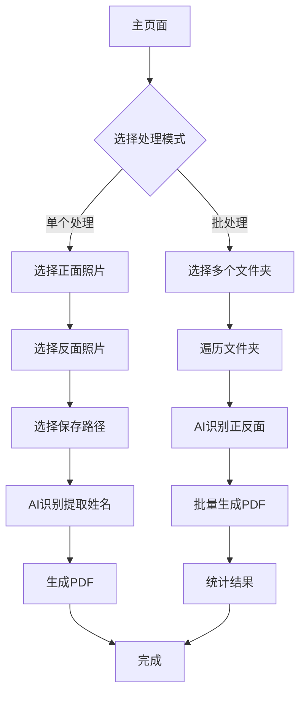

# 身份证照片合并PDF Web应用 - 产品需求文档

## 1. Product Overview
身份证照片合并PDF Web应用是一个基于React的桌面Web应用，帮助用户将身份证正反面照片智能合并为标准PDF文件。
- 解决用户手动整理身份证照片的繁琐问题，通过AI识别技术自动提取姓名并生成规范命名的PDF文件。
- 目标用户为需要批量处理身份证照片的办公人员、档案管理员等，提升工作效率。

## 2. Core Features

### 2.1 Feature Module
我们的身份证PDF合并应用包含以下主要页面：
1. **主页面**：文件选择区域、处理模式切换、操作按钮、进度显示
2. **单个处理模式**：身份证正反面照片选择、保存路径选择、预览区域
3. **批处理模式**：文件夹批量选择、处理进度、结果统计

### 2.2 Page Details

| Page Name | Module Name | Feature description |
|-----------|-------------|---------------------|
| 主页面 | 模式切换 | 提供单个处理和批处理两种模式的切换选项 |
| 主页面 | 文件选择区域 | 根据选择的模式显示不同的文件选择界面 |
| 主页面 | 操作控制 | 开始处理、重置、设置等功能按钮 |
| 主页面 | 进度显示 | 实时显示处理进度和状态信息 |
| 单个处理模式 | 照片选择 | 选择身份证正面和反面照片，支持拖拽和点击选择 |
| 单个处理模式 | 路径选择 | 选择PDF保存的目标文件夹 |
| 单个处理模式 | 预览区域 | 显示选中的照片预览和识别结果 |
| 单个处理模式 | AI识别 | 调用大模型识别身份证正面文字并提取姓名 |
| 单个处理模式 | PDF生成 | 将两张照片合并为A4大小PDF，自动居中布局 |
| 批处理模式 | 文件夹选择 | 支持选择多个包含身份证照片的文件夹 |
| 批处理模式 | 智能识别 | 自动识别每个文件夹中的身份证正反面照片 |
| 批处理模式 | 批量处理 | 遍历所有文件夹，生成PDF并保存到对应位置 |
| 批处理模式 | 结果统计 | 显示成功和失败数量，列出失败的文件夹及原因 |

## 3. Core Process

### 单个处理流程
用户选择单个处理模式 → 选择身份证正面照片 → 选择身份证反面照片 → 选择保存文件夹 → 系统调用AI识别正面文字提取姓名 → 生成PDF文件（姓名+身份证.pdf）→ 保存到指定文件夹

### 批处理流程
用户选择批处理模式 → 选择多个包含照片的文件夹 → 系统遍历每个文件夹 → AI识别文件夹中的身份证正反面照片 → 提取姓名信息 → 生成PDF并保存到对应文件夹 → 统计处理结果

## 4. User Interface Design

### 4.1 Design Style
- 主色调：#2563eb（蓝色），辅助色：#f8fafc（浅灰）
- 按钮样式：圆角矩形，悬停效果，主要按钮使用渐变色
- 字体：系统默认字体，标题16px，正文14px，说明文字12px
- 布局风格：卡片式设计，顶部导航，左右分栏布局
- 图标风格：线性图标，配合适当的emoji表情增加友好感

### 4.2 Page Design Overview

| Page Name | Module Name | UI Elements |
|-----------|-------------|-------------|
| 主页面 | 模式切换 | Tab切换组件，蓝色激活状态，圆角边框 |
| 主页面 | 文件选择区域 | 虚线边框的拖拽区域，支持点击和拖拽，hover状态变化 |
| 主页面 | 操作控制 | 蓝色主按钮，灰色次要按钮，禁用状态样式 |
| 主页面 | 进度显示 | 进度条组件，百分比显示，状态文字提示 |
| 单个处理模式 | 照片选择 | 两个并排的照片选择卡片，带预览功能 |
| 单个处理模式 | 路径选择 | 文件夹图标+路径显示+选择按钮 |
| 单个处理模式 | 预览区域 | 缩略图显示，识别结果文字展示 |
| 批处理模式 | 文件夹选择 | 文件夹列表，支持多选，删除功能 |
| 批处理模式 | 结果统计 | 成功/失败数量的统计卡片，绿色/红色主题 |

### 4.3 Responsiveness
应用采用桌面优先设计，最小支持1024px宽度，支持窗口缩放适配。考虑到文件操作的特殊性，暂不支持移动端。