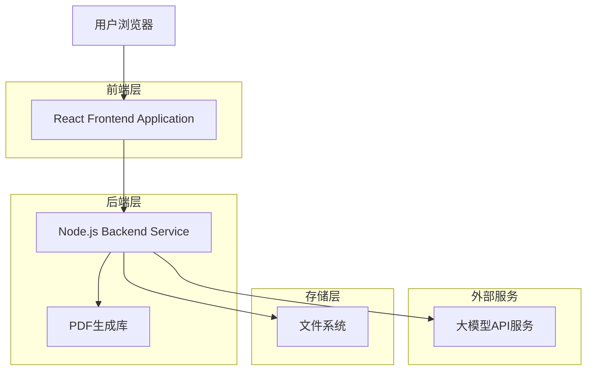
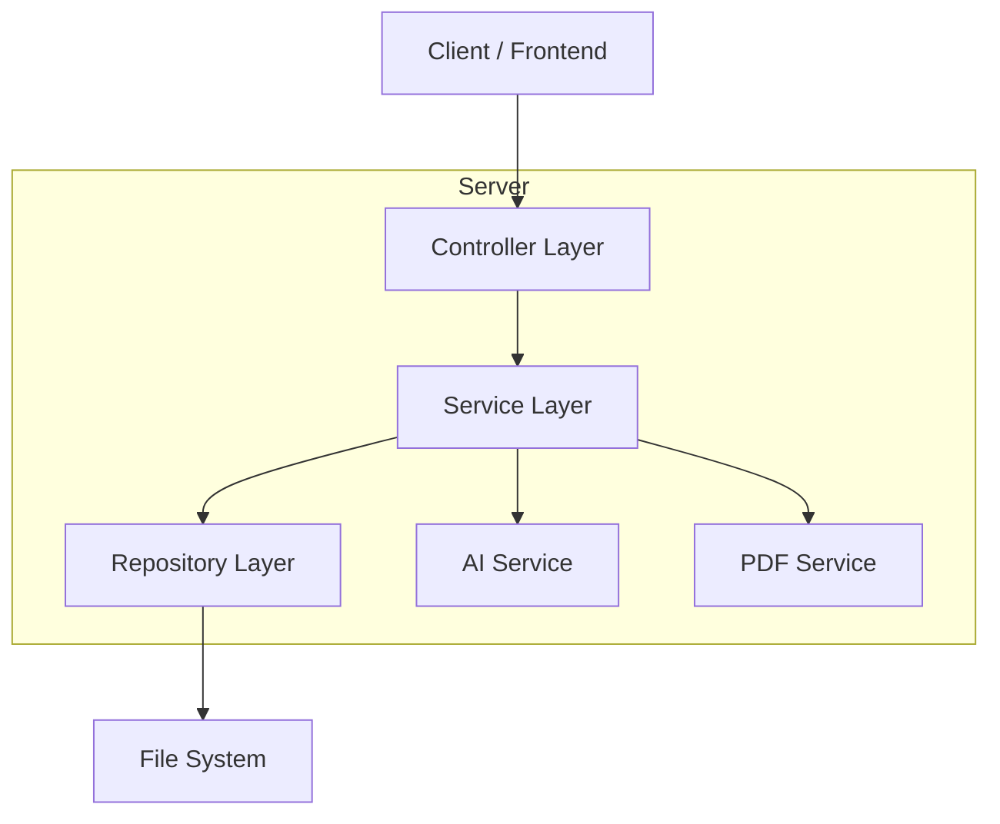
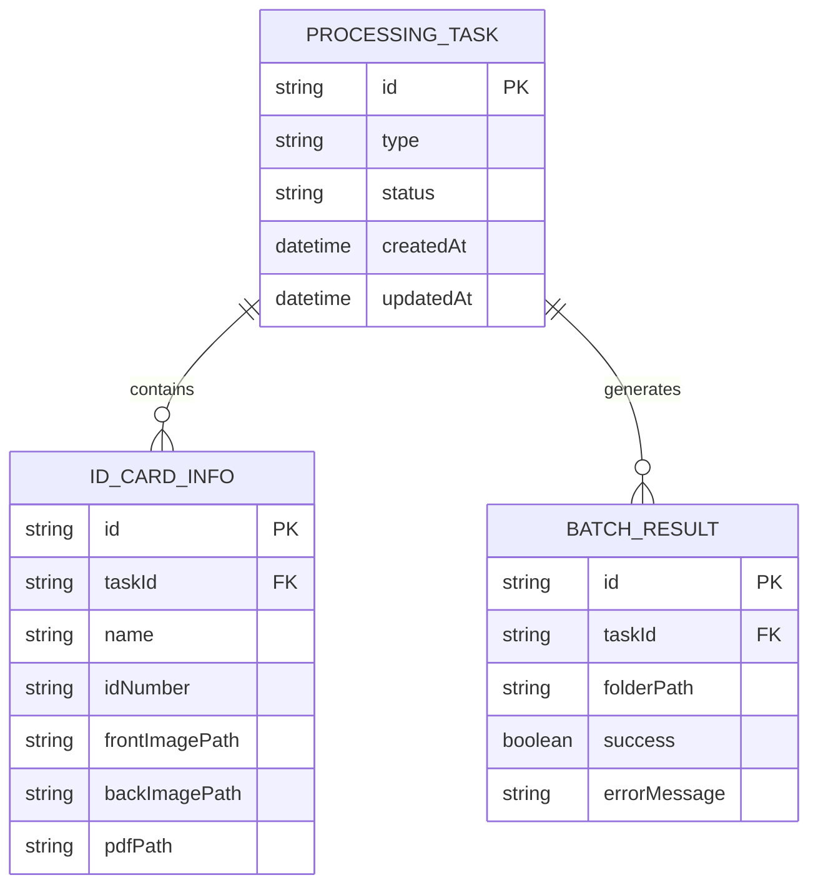

# 身份证照片合并PDF Web应用 - 技术架构文档

## 1. Architecture design



## 2. Technology Description

* Frontend: React\@18 + TypeScript\@5 + Vite\@5 + TailwindCSS\@3

* Backend: Node.js\@18 + Express\@4 + TypeScript\@5

* PDF处理: jsPDF\@2 + pdf-lib\@1.17

* 文件处理: multer\@1.4 + fs-extra\@11

* AI服务: OpenAI API / 百度文心一言 API

* UI组件: Ant Design\@5 + React DnD\@16

## 3. Route definitions

| Route     | Purpose                      |
| --------- | ---------------------------- |
| /         | 主页面，包含模式选择和主要功能界面            |
| /single   | 单个处理模式页面（可选，如果使用单页应用则在主页面切换） |
| /batch    | 批处理模式页面（可选，如果使用单页应用则在主页面切换）  |
| /settings | 设置页面，配置AI API密钥等             |

## 4. API definitions

### 4.1 Core API

身份证识别相关

```
POST /api/ocr/identify
```

Request:

| Param Name | Param Type | isRequired | Description           |
| ---------- | ---------- | ---------- | --------------------- |
| image      | File       | true       | 身份证正面照片文件             |
| type       | string     | true       | 识别类型：'front' 或 'back' |

Response:

| Param Name | Param Type | Description |
| ---------- | ---------- | ----------- |
| success    | boolean    | 识别是否成功      |
| name       | string     | 提取的姓名（仅正面）  |
| idNumber   | string     | 身份证号码（仅正面）  |
| error      | string     | 错误信息        |

Example

```json
{
  "success": true,
  "name": "张三",
  "idNumber": "110101199001011234"
}
```

PDF生成相关

```
POST /api/pdf/generate
```

Request:

| Param Name | Param Type | isRequired | Description |
| ---------- | ---------- | ---------- | ----------- |
| frontImage | File       | true       | 身份证正面照片     |
| backImage  | File       | true       | 身份证反面照片     |
| name       | string     | true       | 身份证姓名       |
| outputPath | string     | true       | 保存路径        |

Response:

| Param Name | Param Type | Description |
| ---------- | ---------- | ----------- |
| success    | boolean    | 生成是否成功      |
| filePath   | string     | 生成的PDF文件路径  |
| error      | string     | 错误信息        |

批处理相关

```
POST /api/batch/process
```

Request:

| Param Name | Param Type | isRequired | Description |
| ---------- | ---------- | ---------- | ----------- |
| folders    | string\[]  | true       | 文件夹路径数组     |

Response:

| Param Name | Param Type | Description |
| ---------- | ---------- | ----------- |
| success    | boolean    | 批处理是否完成     |
| results    | object\[]  | 每个文件夹的处理结果  |
| summary    | object     | 成功和失败统计     |

## 5. Server architecture diagram



## 6. Data model

### 6.1 Data model definition



### 6.2 Data Definition Language

由于这是一个桌面Web应用，主要使用文件系统存储，不需要传统数据库。数据结构主要通过TypeScript接口定义：

```typescript
// 身份证信息接口
interface IdCardInfo {
  id: string;
  name: string;
  idNumber: string;
  frontImagePath: string;
  backImagePath: string;
  pdfPath?: string;
}

// 处理任务接口
interface ProcessingTask {
  id: string;
  type: 'single' | 'batch';
  status: 'pending' | 'processing' | 'completed' | 'failed';
  createdAt: Date;
  updatedAt: Date;
  idCards: IdCardInfo[];
}

// 批处理结果接口
interface BatchResult {
  folderPath: string;
  success: boolean;
  errorMessage?: string;
  idCard?: IdCardInfo;
}

// 批处理统计接口
interface BatchSummary {
  total: number;
  success: number;
  failed: number;
  failedFolders: string[];
}
```

文件存储结构：

```
temp/
├── uploads/          # 临时上传文件
├── processed/        # 处理后的PDF文件
└── logs/            # 处理日志
```

